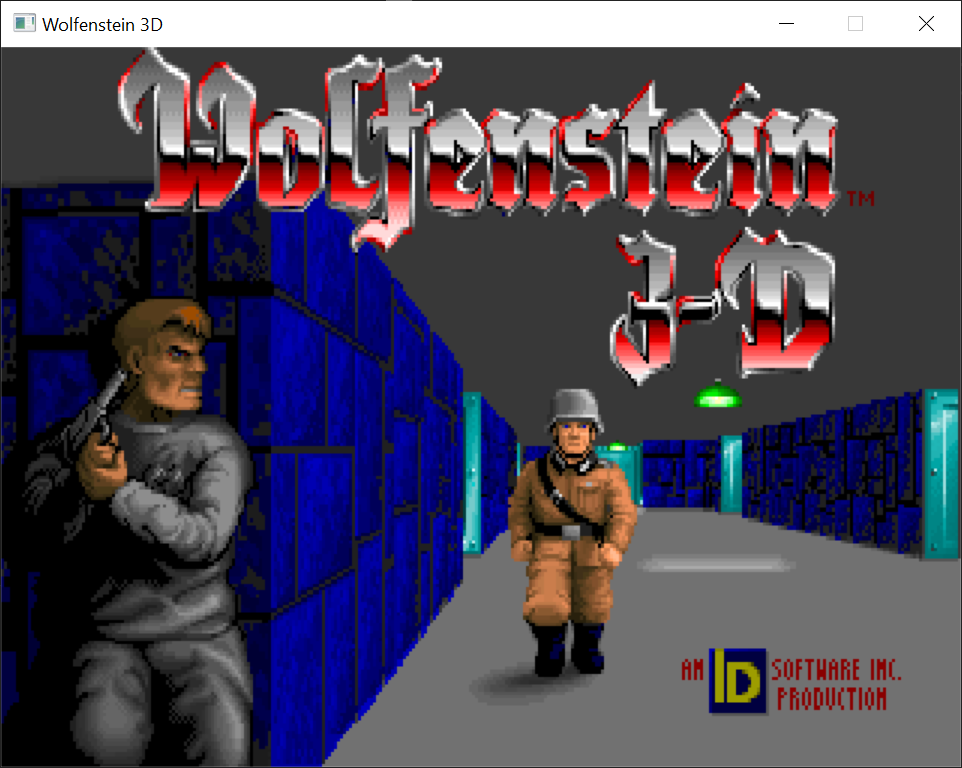

chocolate-wolfenstein-3D
========================



This is a fork of Fabien Sanglard's [Chocolate-Wolfenstein-3D](https://github.com/fabiensanglard/Chocolate-Wolfenstein-3D) which upgrades the codebase to use SDL2 and makes some
other small changes.

* Enhanced 640x400 display resolution which scales up to any screen size.
* Corrects the aspect ratio to 4:3 (640x480) to emulate what gamers experienced in 1993.
* Support for modern game controllers (Xbox, PS3/PS4, etc) via the SDL2 GameController API.
    * When using a modern game controller, the game supports moving and strafing at the same time.
* Using CMake for cross-platform builds.

This is still a WIP. Things I'm planning to do:
- [ ] Modern keyboard and mouse controls (WASD movement, mouse to turn).
- [ ] Emulation of DOS launcher for Spear of Destiny which allows you to select episode.
- [ ] Package Wolf3D and SOD for all pc platforms via CMake.
- [ ] Configure graphics from the in-game menu (fullscreen, video scale, etc).
- [ ] Ports to other platforms/game consoles (Serenity, PSP, PS Vita, etc).

## Build & Run

### Data Files

First copy your Wolf3D data files into the `data` directory. The files needed are:

```
audiohed
audiot
gamemaps
maphead
vgadict
vgagraph
vgahead
vswap
```

The data files can have the following extensions:

* .wl1 - Wolfenstein 3D shareware version (episode 1 only)
* .wl6 - Wolfenstein 3D full version (episode 1 to 6)
* .sod - Wolfenstein 3D Spear of Destiny demo and full version
* .sd2 - Wolfenstein 3D Spear of Destiny Mission 2: Return to Danger
* .sd3 - Wolfenstein 3D Spear of Destiny Mission 3: Ultimate Challenge

You will need to ensure the game is configured for your version of the data files. You can do this by enabling specific
definitions in the `version.h` file, which has some comments with instructions about what to configure. By default, the
game is configured for the `.wl1` shareware data files. If you have the `.wl6` files for the full game, then only
`GOODTIMES` and `CARMACIZED` should be defined.

*Note: The game expects the data files to be in lowercase (e.g VSWAP.WL1 -> wswap.wl1). But if your computers filesystem is case
in-sensitive then this won't matter. So if you have all the correct data files, but the game isn't loading them then try
renaming them all to lowercase.*

If you don't have data files, here are some links:
* [Shareware files for Wolfenstein 3D](http://maniacsvault.net/ecwolf/files/shareware/wolf3d14.zip)
* [Shareware files for Spear of Destiny](http://maniacsvault.net/ecwolf/files/shareware/soddemo.zip)
* [Purchase the full game](https://www.gog.com/game/wolfenstein_3d_and_spear_of_destiny?pp=979014556ab8cdd13048702896fb99fcc40fe793)

### OSX

These instructions assume you have Homebrew installed. If you don't, please [install](https://brew.sh/) it.

Install all the required dependencies:

```shell
brew update
brew install cmake sdl2 sdl2_mixer
```

Navigate to the cloned repository and generate the build files:

```shell
mkdir build && cd build
cmake ..
```

Compile the game:

```shell
make -j4
```

Run the game:

```shell
./chocolate-wolfenstein-3D
```

### Windows

Visual Studio 2019 for C++ has built-in support for CMake projects. So directly opening the project in Visual Studio
and building from there is easiest. If you don't have it you can install it from [here](https://visualstudio.microsoft.com/vs/).

Be sure to generate the CMake cache and select `Chocolate-Wolfenstein-3D.exe` as the target.

### Linux

These instructions assume you are using Ubuntu. If you're on a different distribution, ensure you have the 
dependencies installed, and the instructions should be identical.

Install all the required dependencies:

```shell
sudo apt update
sudo apt install cmake libsdl2-dev libsdl2-mixer-dev
```

Navigate to the cloned repository and generate the build files:

```shell
mkdir build && cd build
cmake ..
```

Compile the game:

```shell
make -j4
```

Run the game:

```shell
./chocolate-wolfenstein-3D
```

## Hacking

If you want to modify the source and debug the game, then using an IDE that supports CMake is the easiest way.
I personally use CLion, but on Windows Visual Studio 2019 works well too.

## Play

### Command Line Arguments

**Option**|**Description**
:-----:|:-----:
--help|Show all command line options.
--windowed|Run the game in a window.
--tedlevel <level>|Starts the game in the given level
--baby|Sets the difficulty to baby for tedlevel
--easy|Sets the difficulty to easy for tedlevel
--normal|Sets the difficulty to normal for tedlevel
--hard|Sets the difficulty to hard for tedlevel
--nowait|Skips intro screens
--windowed[-mouse]|Starts the game in a window [and grabs mouse]
--ignorenumchunks|Ignores the number of chunks in VGAHEAD.* (may be useful for some broken mods)
--configdir <dir>|Directory where config file and save games are stored (Windows default: current directory

### Game Controller Support

With the help of the SDL2 GameController API the game now supports modern controllers (Xbox 360, Xbox One, PS3/PS4, etc).

Here is the button layout for controllers. This is not currently customizable.

**Action**|**Button**
:-----:|:-----:
Move Forward/Backward|Left-Stick Up/Down
Strafe Left/Right|Left-Stick Left/Right
Look Left/Right|Right-Stick Left/Right
Use|A
Shoot|Right-Trigger or Right-Shoulder
Sprint|Left-Trigger or Left-Shoulder
Cycle Previous Weapon|Y
Cycle Next Weapon|B
Pause|Pause
Escape|Back

*Note: When using a controller, the game now supports moving and strafing at the same time.*

## Credits

* [Fabien Sanglard](https://fabiensanglard.net/) for original [Chocolate-Wolfenstein-3D](https://github.com/fabiensanglard/Chocolate-Wolfenstein-3D).
* Based on Wolf4SDL by Moritz "Ripper" Kroll (http://www.chaos-software.de.vu).
* Original Wolfenstein 3D by id Software (http://www.idsoftware.com).
